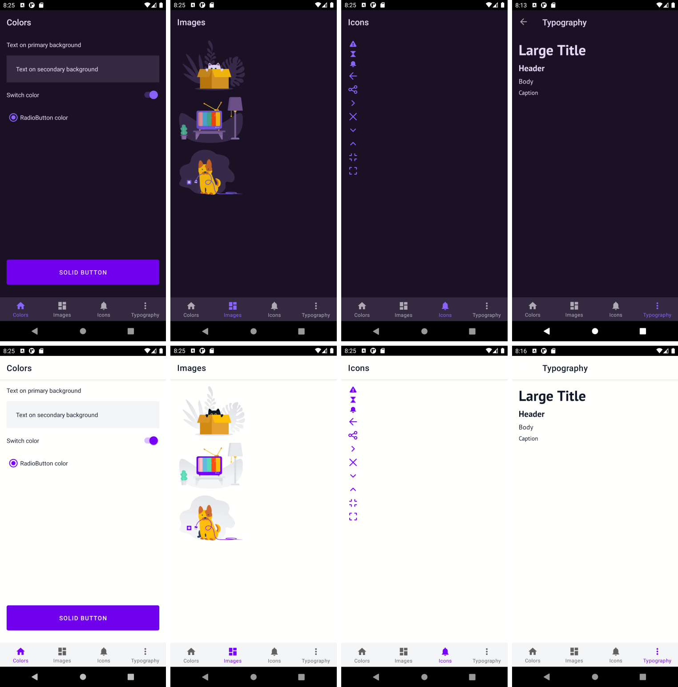

## Example projects

The UI-Kit of the example project in Figma:

[FigmaExport Example File [Light]](https://www.figma.com/file/BEjfU0kCVnPqXdRLfoLvkf/FigmaExport-Example-File-Dark)

[FigmaExport Example File [Dark]](https://www.figma.com/file/QwF30YrucxVwQyBNT0C09i/FigmaExport-Example-File-Dark)

### Example iOS project

There are 2 example iOS projects in `Example` and `ExampleSwiftUI` directories which demostrates how to use figma-export with UIKit and SwiftUI.

**How to setup iOS project**
1. Open `Example/fastlane/.env` file.
2. Change FIGMA_PERSONAL_TOKEN to your personal Figma token.
3. Go to `Example` folder.
4. Run the following command in Termanal to install cocoapods and fastlane: `bundle install`
5. Run the following command in Termanal to install figma-export: `bundle exec pod install`

**How to export resources from figma**
* To export colors run: `bundle exec fastlane export_colors`
* To export icons run: `bundle exec fastlane export_icons`
* To export images run: `bundle exec fastlane export_images`
* To export typography run: `bundle exec fastlane export_typography`

### Example Android project

There is an example Android Studio project in `AndroidExample` directory which demostrates how to use `figma-export`.

**How to export resources from figma to the project**
* To export colors run: `figma-export colors`
* To export icons run: `figma-export icons`
* To export images run: `figma-export images`
