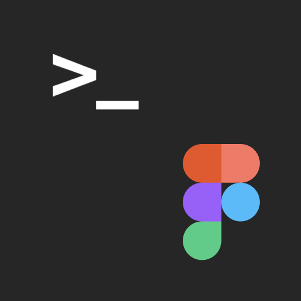

# FigmaExport



[](https://swift.org/package-manager)
[](https://github.com/RedMadRobot/Catbird/blob/master/LICENSE)
[](https://cocoapods.org/pods/FigmaExport)

Command line utility to export colors, icons and images from Figma to Xcode / Android Studio project.
* color - Figma's color style
* icon — Figma's component with small black vector image
* image — Figma's components with colorized image (Light/Dark)

Why we developed this utility:
* Figma doesn't support exporting colors and images to Xcode / Android Studio. Manual export takes a long time.
* For easy sync of the component library with the code

## Features

* Export light & dark color palette directly to Xcode / Android studio project
* Export icons to Xcode / Android Studio project 
* Export images to Xcode / Android Studio project

> Exporting icons and images works only for Professional/Organisation Figma plan because FigmaExport use *Shareable team libraries*.

## Result

### iOS

#### Colors

When your execute `figma-export colors` command `figma-export` exports colors from Figma directly to your Xcode project to the Assets.xcassets folder.

Figma light | Figma dark | Xcode
------------ | ------------- | -------------
 |  | 

Additionally the `Color.swift` file will be created to use colors from the code.

```swift
 import UIKit
 
 extension UIColor {
    static var backgroundSecondaryError: UIColor { return UIColor(named: #function)! }
    static var backgroundSecondarySuccess: UIColor { return UIColor(named: #function)! }
    static var backgroundVideo: UIColor { return UIColor(named: #function)! }
    ...
 }

```

If you set option `useColorAssets: False` in the configuration file, then will be generated code like this:
```swift
import UIKit

extension UIColor {
    static var primaryText: UIColor {
        UIColor { traitCollection -> UIColor in
            if traitCollection.userInterfaceStyle == .dark {
                return UIColor(red: 0.000, green: 0.000, blue: 0.000, alpha: 1.000)
            } else {
                return UIColor(red: 1.000, green: 1.000, blue: 1.000, alpha: 1.000)
            }
        }
    }
    static var backgroundVideo: UIColor {
        return UIColor(red: 0.467, green: 0.012, blue: 1.000, alpha: 0.500)
    }
}
```

#### Icons

Icons will be exported as PDF files with `Template Image` render mode.


#### Images

Images will be exported as PNG files the same way.


### Android

Colors will be exported to `values/colors.xml` and `values-night/colors.xml` files.

Icons will be exported to `drawable` directory as vector xml files.

Images will be exported to `drawable` and `drawable-night` directory as vector xml files.

## Installation

 Before installation you must provide Figma personal access token via environment variables.

 ```export FIGMA_PERSONAL_TOKEN=value```

 This token gives you access to the Figma API. Generate a personal Access Token through your user profile page or on [Figma API documentation website](https://www.figma.com/developers/api#access-tokens). If you use Fastlane just add the following line to `fastlane/.env` file

 ```FIGMA_PERSONAL_TOKEN=value```

### Manual
[Download](https://github.com/RedMadRobot/figma-export/releases) latest release and read [Usage](#usage)

### Homebrew
```
brew install RedMadRobot/formulae/figma-export
```

### CocoaPods + Fastlane
Add the following line to your Podfile:
```ruby
pod 'FigmaExport'
```

This will download the FigmaExport binaries and dependencies in `Pods/` during your next
`pod install` execution and will allow you to invoke it via `Pods/FigmaExport/Release/figma-export` in your Fastfile.

Add the following line to your Fastfile:
```ruby
lane :sync_colors do
  Dir.chdir("../") do
    sh "Pods/FigmaExport/Release/figma-export colors ."
  end
end
```

Don't forget to place figma-export.yaml file at the root of the project directory.

Run `fastlane sync_colors` to run FigmaExport.

## Usage
1. Open `Terminal.app`
2. Go (cd) to folder with `figma-export` file
3. Run `figma-export`
  
   To export colors use `colors` argument:

   `./figma-export colors -i figma-export.yaml`

   To export icon use `icons` argument:

   `./figma-export icons -i figma-export.yaml`
   
   To export images use `images` argument:

   `./figma-export images -i figma-export.yaml`
   

## Parameters

Argument `-i` or `-input` specifies path to `figma-export.yaml` file where all the properties stores: figma, ios, android.

If `figma-export.yaml` file is next to the `figma-export` executable file you can omit `-i` option.

 `./figma-export colors`

Example of `figma-export.yaml` file:
```yaml
---
figma:
  lightFileId: shPilWnVdJfo10YFo12345
  darkFileId: KfF6DnJTWHGZzC9Nm12345

# [optional] Common export parameters
common:
  colors:
    # RegExp pattern for color name validation before exporting 
    nameValidateRegexp: '^[a-zA-Z_]+$' # RegExp pattern for: background, background_primary, widget_primary_background
  icons:
    # RegExp pattern for icon name validation before exporting 
    nameValidateRegexp: '^(ic)_(\d\d)_([a-z0-9_]+)$' # RegExp pattern for: ic_24_icon_name, ic_24_icon
  images:
    # RegExp pattern for image name validation before exporting
    nameValidateRegexp: '^(img)_([a-z0-9_]+)$' # RegExp pattern for: img_image_name

# [optional] iOS export parameters
ios:
  # Path to the Assets.xcassets directory
  xcassetsPath: "./Resources/Assets.xcassets"
  
  # Parameters for exporting colors
  colors:
    # Should be generate color assets instead of pure swift code 
    useColorAssets: True
    # Name of the folder inside Assets.xcassets where to place colors (.colorset directories)
    assetsFolder: Colors
    # Path to Color.swift file where to export colors for accessing colors from the code (e.g. UIColor.backgroundPrimary)
    colorSwift: "./Sources/Presentation/Common/Color.swift"
    # Color name style: camelCase or snake_case
    nameStyle: camelCase

  # Parameters for exporting icons
  icons:
    # Name of the folder inside Assets.xcassets where to place icons (.imageset directories)
    assetsFolder: Icons
    # Icon name style: camelCase or snake_case
    nameStyle: camelCase
    # [optional] Enable Preserve Vector Data for specified icons
    preservesVectorRepresentation:
    - ic24TabMain
    - ic24TabHistory
    - ic24TabProfile

  # Parameters for exporting images
  images:
      # Name of the folder inside Assets.xcassets where to place images (.imageset directories)
      assetsFolder: Illustrations
      # Image name style: camelCase or snake_case
      nameStyle: camelCase

# [optional] Android export parameters
android:
  mainRes: "./main/res"

```
### Figma properties 

* `figma.lightFileId` — Id of the file containing light color palette and dark images. To obtain a file id, open the file. The file id will be present in the URL after the word file and before the file name.
* `figma.darkFileId` — (Optional) Id of the file containing dark color palette and dark images.

### iOS properties
* `ios.xcassetsPath` — Relative or absolute path to directory `Assets.xcassets` where to export colors, icons and images.
* `ios.colors.useColorAssets` — How to export colors - as assets or as swift UIColor initializers only.
* `ios.colors.assetsFolder` — Name of the folder inside `Assets.xcassets` where colors will be exported. Used only if `useColorAssets == true`.
* `ios.colors.colorSwift` — Relative or absolute path to `Color.swift` file.
* `ios.colors.nameStyle` — Color name style: camelCase or snake_case
* `ios.icons.assetsFolder` — Name of the folder inside `Assets.xcassets` where icons will be exported.
* `ios.icons.nameStyle` — Icon name style: camelCase or snake_case
* `ios.icons.preservesVectorRepresentation` — An array of icon names that will supports Preseve Vecotor Data.
* `ios.images.assetsFolder` — Name of the folder inside `Assets.xcassets` where images will be exported.
* `ios.images.nameStyle` — Images name style: camelCase or snake_case
 
### Android properties
* `android.path` — Relative or absolute path to the `main/res` folder including it. The colors will be exported to `./values/colors.xml` and `./values-night/colors.xml`.

## Design requirements

### Common
If a color, icon or image is unique for iOS or Android platform, it should contains "ios" or "android" word in the description field in the properties. If a color, icon or image is used only by the designer and it should not be exported, the word "none" should be specified in the description field.

Styles and Components must be published to a Team Library.

### For `figma-export colors`
If you support dark mode your figma project must contains two files. One should contains a dark color palette, and the another light color palette. Names and number of the colors must matches.

#### Example

File | Styles
------------ | -------------
 | 
 | 

### For `figma-export icons`
Your figma project must contains a file with `Icons` frame.
If you support dark mode you must have two Figma files. Each must have `Icons` frame.

### For `figma-export images`
Your figma project must contains a file with `Illustrations` frame.
If you support dark mode you must have two Figma files. Each must have `Illustrations` frame.

## Example iOS project

There is an example iOS project in `Example` directory which demostrates how to use figma-export.


The UI-Kit of this project in Figma:

[FigmaExport Example File [Light]](https://www.figma.com/file/BEjfU0kCVnPqXdRLfoLvkf/FigmaExport-Example-File-Dark)

<a href="https://www.figma.com/file/BEjfU0kCVnPqXdRLfoLvkf/FigmaExport-Example-File-Dark"></a>

[FigmaExport Example File [Dark]](https://www.figma.com/file/QwF30YrucxVwQyBNT0C09i/FigmaExport-Example-File-Dark)

<a href="https://www.figma.com/file/QwF30YrucxVwQyBNT0C09i/FigmaExport-Example-File-Dark"></a>

**How to setup iOS project**
1. Open `Example/fastlane/.env` file.
2. Change FIGMA_PERSONAL_TOKEN to your personal Figma token.
3. Go to `Example` folder.
4. Run the following command in Termanal to install cocoapods and fastlane: `bundle install`
5. Run the following command in Termanal to install figma-export: `bundle exec pod install`

**How to export resources from figma**
* To export colors run: `bundle exec fastlane export_colors`
* To export icons run: `bundle exec fastlane export_icons`
* To export images run: `bundle exec fastlane export_images`

## Contributing

We'd love to accept your pull requests to this project.

## License

figma-export is released under the MIT license. [See LICENSE](./LICENSE) for details.

## Feedback

If you have any issues with the FigmaExport or you want some new features feel free to create an issue or contact me.

## Authors

Daniil Subbotin - d.subbotin@redmadrobot.com
