# FigmaExport

<br/>

[](https://swift.org/package-manager)
[](https://github.com/RedMadRobot/Catbird/blob/master/LICENSE)
[](https://cocoapods.org/pods/FigmaExport)
[](https://codebeat.co/projects/github-com-redmadrobot-figma-export-master)
[](https://github.com/RedMadRobot/figma-export/actions/workflows/tests.yml)

Command line utility to export colors, typography, icons and images from Figma to Xcode / Android Studio project.
* color - Figma's color style
* typography - Figma's text style
* icon — Figma's component with small black/colorized vector image
* image — Figma's components with colorized image (Light/Dark)

The utility supports Dark Mode, SwiftUI and Jetpack Compose.

Why we've developed this utility:
* Figma doesn't support exporting colors and images to Xcode / Android Studio. Manual export takes a long time.
* For easy sync of the component library with the code

Articles:
* [[habr.com] FigmaExport: как автоматизировать экспорт UI-Kit из Figma в Xcode и Android Studio проекты](http://habr.com/ru/company/redmadrobot/blog/514118/)

Table of Contents:
- [Features](#features)
- [Result](#result)
  - [iOS](#ios)
  - [Android](#android)
- [Installation](#installation)
  - [Manual](#manual)
  - [Homebrew](#homebrew)
  - [CocoaPods + Fastlane](#cocoapods--fastlane)
- [Usage](#usage)
  - [Android](#android-1)
  - [Arguments](#arguments)
  - [Configuration](#configuration)
  - [Exporting Typography](#exporting-typography)
- [Design requirements](#design-requirements)
- [Example project](#example-project)
- [Contributing](#contributing)
- [License](#license)
- [Feedback](#feedback)
- [Authors](#authors)

## Features

* Export light & dark color palette directly to Xcode / Android studio project
* Export icons to Xcode / Android Studio project 
* Export images to Xcode / Android Studio project
* Export text styles to Xcode / Android Studio project
* Supports Dark Mode
* Supports SwiftUI and UIKit
* Supports Objective-C

> Exporting icons and images works only for Professional/Organisation Figma plan because FigmaExport use *Shareable team libraries*.

## Result

### iOS

#### Colors

When your execute `figma-export colors` command, `figma-export` exports colors from Figma directly to your Xcode project to the Assets.xcassets folder.

| Figma light                                      | Figma dark                                            | Xcode                                     |
|--------------------------------------------------|-------------------------------------------------------|-------------------------------------------|
| 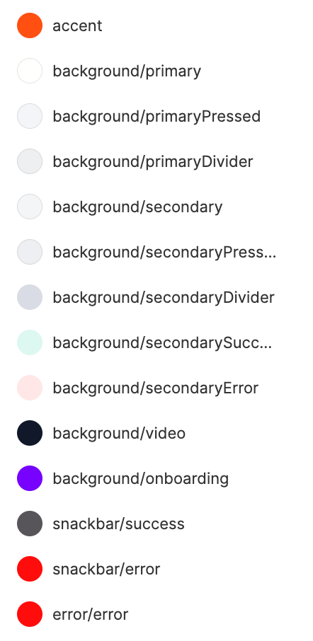 | 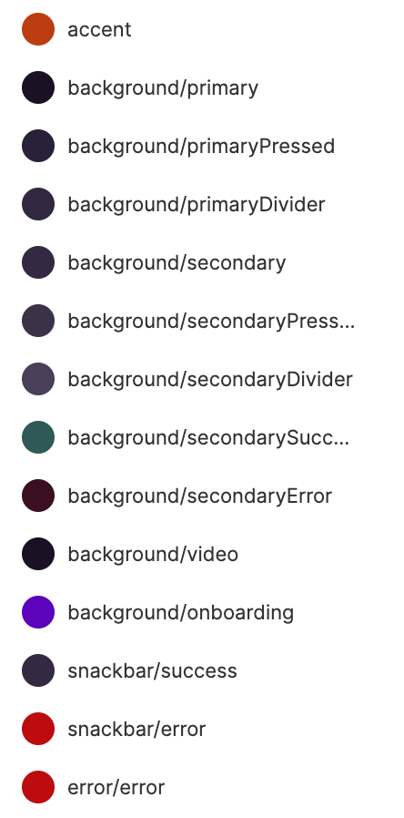 | 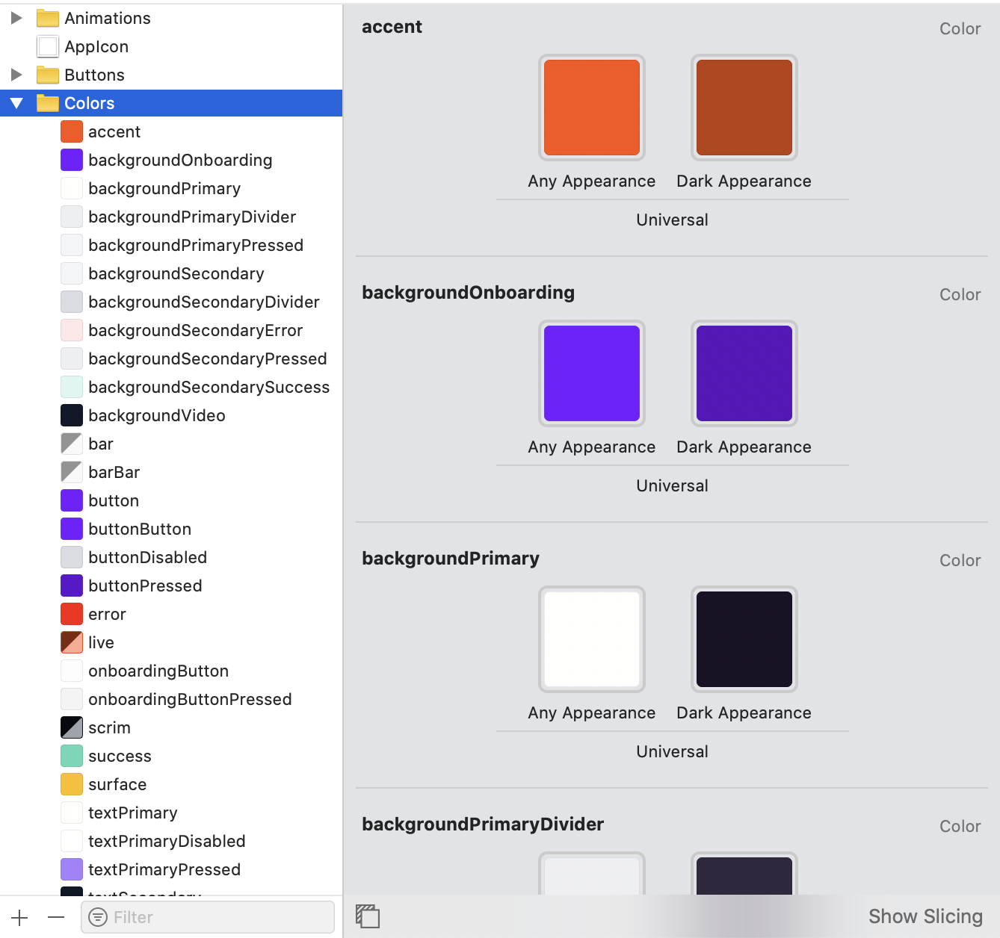 |

Additionally, the following Swift file will be created to use colors from the code.

```swift
 import UIKit
 
 extension UIColor {
    static var backgroundSecondaryError: UIColor { return UIColor(named: #function)! }
    static var backgroundSecondarySuccess: UIColor { return UIColor(named: #function)! }
    static var backgroundVideo: UIColor { return UIColor(named: #function)! }
    ...
 }

```

For SwiftUI the following Swift file will be created to use colors from the code.

```swift
 import SwiftUI
 
 extension Color {
    static var backgroundSecondaryError: Color { return Color(#function) }
    static var backgroundSecondarySuccess: Color { return Color(#function) }
    static var backgroundVideo: Color { return Color(#function) }
    ...
 }

```

If you set option `useColorAssets: False` in the configuration file, then will be generated code like this:
```swift
import UIKit

extension UIColor {
    static var primaryText: UIColor {
        if #available(iOS 13.0, *) {
            return UIColor { traitCollection -> UIColor in
                if traitCollection.userInterfaceStyle == .dark {
                    return UIColor(red: 0.000, green: 0.000, blue: 0.000, alpha: 1.000)
                } else {
                    return UIColor(red: 1.000, green: 1.000, blue: 1.000, alpha: 1.000)
                }
            }
        } else {
            return UIColor(red: 1.000, green: 1.000, blue: 1.000, alpha: 1.000)
        }
    }
    static var backgroundVideo: UIColor {
        return UIColor(red: 0.467, green: 0.012, blue: 1.000, alpha: 0.500)
    }
}
```

#### Icons

Icons will be exported as PDF or SVG files with `Template Image` render mode.

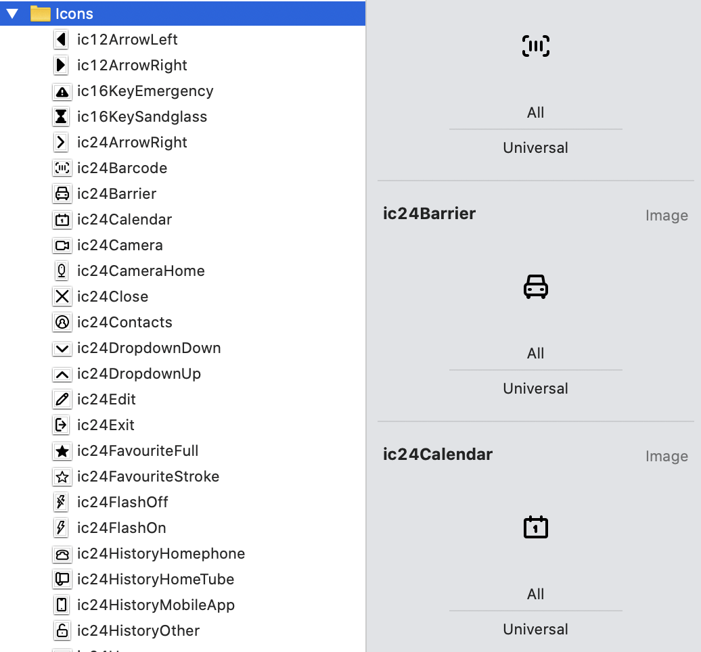

Additionally, the following Swift file will be created to use icons from the code.

```swift
import UIKit

extension UIImage {
    static var ic16Notification: UIImage { return UIImage(named: #function)! }
    static var ic24ArrowRight: UIImage { return UIImage(named: #function)! }
    static var ic24Close: UIImage { return UIImage(named: #function)! }
    static var ic24Dots: UIImage { return UIImage(named: #function)! }
    ...
}
```

For SwiftUI the following Swift file will be created to use images from the code.

```swift
import SwiftUI

extension Image {
    static var ic16Notification: Image { return Image(#function) }
    static var ic24Close: Image { return Image(#function) }
    static var ic24DropdownDown: Image { return Image(#function) }
    static var ic24DropdownUp: Image { return Image(#function) }
    ...
}
...
VStack {
  Image.ic24Close
  Image.ic24DropdownDown
}
...
```

#### Images

Images will be exported as PNG files the same way.

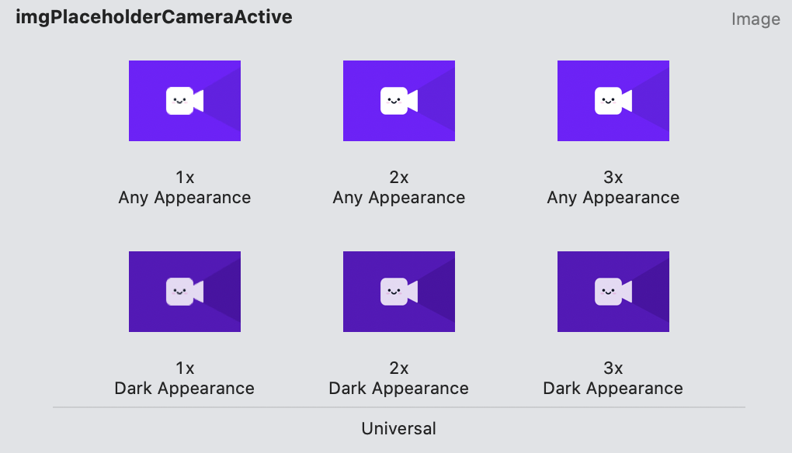

Additionally, the following Swift file will be created to use images from the code.

```swift
import UIKit

extension UIImage {
    static var illZeroEmpty: UIImage { return UIImage(named: #function)! }
    static var illZeroNetworkError: UIImage { return UIImage(named: #function)! }
    static var illZeroServerError: UIImage { return UIImage(named: #function)! }
    ...
}
```

For SwiftUI a Swift file will be created to use images from the code.

#### Images with multiple idiom
If name of an image contains idiom at the end (e.g. ~ipad), it will be exported like this:

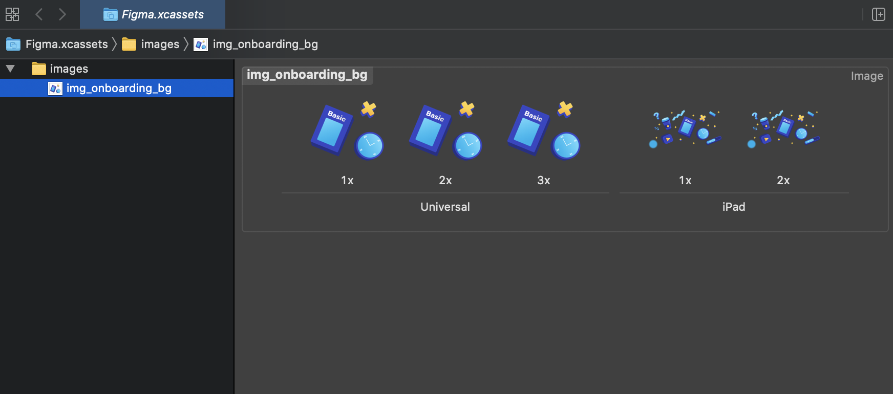

#### Typography

When your execute `figma-export typography` command `figma-export` generates 3 files:
1. `UIFont+extension.swift` extension for UIFont that declares your custom fonts. Use these fonts like this `UIFont.header()`, `UIFont.caption1()`.
2. `LabelStyle.swift` struct for generating attributes for NSAttributesString with custom lineHeight and tracking (letter spacing).
3. `Label.swift` file that contains base Label class and class for each text style. E.g. HeaderLabel, BodyLabel, Caption1Label. Specify these classes in xib files on in code.

Example of these files:
- [./Examples/Example/UIComponents/Source/Label.swift](./Examples/Example/UIComponents/Source/Label.swift)
- [./Examples/Example/UIComponents/Source/LabelStyle.swift](./Examples/Example/UIComponents/Source/LabelStyle.swift)
- [./Examples/Example/UIComponents/Source/UIFont+extension.swift](./Examples/Example/UIComponents/Source/UIFont+extension.swift)

### Android

Colors will be exported to `values/colors.xml` and `values-night/colors.xml` files.
For Jetpack Compose, following code will be generated, if configured:
```kotlin
package com.redmadrobot.androidcomposeexample.ui.figmaexport

import ...

object Colors

@Composable
@ReadOnlyComposable
fun Colors.backgroundPrimary(): Color = colorResource(id = R.color.background_primary)
```

Icons will be exported to `drawable` directory as vector xml files. For Jetpack Compose, following code will be generated, if configured:
```kotlin
package com.redmadrobot.androidcomposeexample.ui.figmaexport

import ...

object Icons

@Composable
fun Icons.Ic24DropdownDown(
    contentDescription: String?,
    modifier: Modifier = Modifier,
    tint: Color = Color.Unspecified
) {
    Icon(
        painter = painterResource(id = R.drawable.ic_24_dropdown_down),
        contentDescription = contentDescription,
        modifier = modifier,
        tint = tint
    )
}
```

Vector images will be exported to `drawable` and `drawable-night` directories as vector `xml` files.
Raster images will be exported to `drawable-???dpi` and `drawable-night-???dpi` directories as `png` or `webp` files.

Typography will be exported to `values/typography.xml`. For Jetpack Compose, following code will be generated, if configured:
```kotlin
package com.redmadrobot.androidcomposeexample.ui.figmaexport

import ...

object Typography {

    val body = TextStyle(
        fontFamily = FontFamily(Font(R.font.ptsans_regular)),
        fontSize = 16.0.sp,
        letterSpacing = 0.0.sp,
        lineHeight = 24.0.sp,
    )
}
```

## Installation

 Before installation you must provide Figma personal access token via environment variables.

 ```export FIGMA_PERSONAL_TOKEN=value```

 This token gives you access to the Figma API. Generate a personal Access Token through your user profile page or on [Figma API documentation website](https://www.figma.com/developers/api#access-tokens). If you use Fastlane just add the following line to `fastlane/.env` file

 ```FIGMA_PERSONAL_TOKEN=value```

### Manual
[Download](https://github.com/RedMadRobot/figma-export/releases) the latest release and read [Usage](#usage)

### Homebrew
```
brew install RedMadRobot/formulae/figma-export
```
If you want to export raster images in WebP format install [cwebp](https://developers.google.com/speed/webp/docs/using) command line utility.
```
brew install webp
```

### CocoaPods + Fastlane
Add the following line to your Podfile:
```ruby
pod 'FigmaExport'
```

This will download the FigmaExport binaries and dependencies in `Pods/` during your next
`pod install` execution and will allow you to invoke it via `Pods/FigmaExport/Release/figma-export` in your Fastfile.

Add the following line to your Fastfile:
```ruby
lane :sync_colors do
  Dir.chdir("../") do
    sh "Pods/FigmaExport/Release/figma-export colors ."
  end
end
```

Don't forget to place figma-export.yaml file at the root of the project directory.

Run `fastlane sync_colors` to run FigmaExport.

## Usage
1. Open `Terminal.app`
2. Go (cd) to the folder with `figma-export` binary file
3. Run `figma-export`
  
   To export colors use `colors` argument:

   `./figma-export colors -i figma-export.yaml`

   To export icons use `icons` argument:

   `./figma-export icons -i figma-export.yaml`
   
   To export images use `images` argument:

   `./figma-export images -i figma-export.yaml`

   To export typography use `typography` argument:

   `./figma-export typography -i figma-export.yaml`

### Android

In the `figma-export.yaml` file you must specify the following properties:
- `android.mainRes`
- `android.resourcePackage` if you want to generate Jetpack Compose code
- `android.mainSrc` if you want to generate Jetpack Compose code
- `android.icons.output` if you want to export icons
- `android.images.output` if you want to export images

When you execute `figma-export icons` command, FigmaExport clears the `{android.mainRes}/{android.icons.output}` directory before exporting all the icons.

When you execute `figma-export images` command, FigmaExport clears the `{android.mainRes}/{android.images.output}` directory before exporting all the images.

Example folder structure:
```
main/
  res/
    figma-export-icons/
      drawable/
      drawable-night/
    figma-export-images/
      drawable/
      drawable-night/
```

Before first running `figma-export` you must add path to these directories in the app‘s `build.gradle` file.

```
...
android {
  ...
  sourceSets {
    main {
      res.srcDirs += "src/main/res/figma-export-icons"
      res.srcDirs += "src/main/res/figma-export-images"
    }
  }
}
```

#### Jetpack Compose
For Typography, Colors and Icons you can enable code generation for the use with Jetpack Compose in your [config file](CONFIG.md):
1. Configure `android.mainSrc`
2. Configure `android.[typography|colors|icons].composePackageName`

### Arguments

If you want to export specific icons/images you can list their names in the last argument like this:

`./figma-export icons "ic/24/edit"` — Exports only one icon.

`./figma-export icons "ic/24/edit, ic/16/notification"` — Exports two icons

`./figma-export icons "ic/24/videoplayer/*"` — Exports all icons which names starts with `ic/24/videoplayer/`

`./figma-export icons` — Exports all the icons.

Argument `-i` or `-input` specifies path to FigmaExport configuration file `figma-export.yaml`.

### Configuration

All available configuration options described in the [CONFIG.md](CONFIG.md) file.

Example of `figma-export.yaml` file for iOS project — [Examples/Example/figma-export.yaml](./Examples/Example/figma-export.yaml)

Example of `figma-export.yaml` file for Android project — [Examples/AndroidExample/figma-export.yaml](./Examples/AndroidExample/figma-export.yaml)

Generate `figma-export.yaml` config file using one of the following command:
```
figma-export init --platform android
figma-export init --platform ios
```
It will generate config file in the current directory.

#### Custom templates

##### iOS
If you want to modify structure of the generated `*.swift` files you should specify a directory (`ios.templatesPath`) where Stencil templates are located. If `ios.templatesPath` not specified default templates will be used.

Default Stencil templates for iOS located here: `./Sources/XcodeExport/Resources`
Custom Stencil templates must have the following names:
- UIColor+extension.swift.stencil for UIKit colors
- Color+extension.swift.stencil for SwiftUI colors
- UIImage+extension.swift.stencil for UIKit images
- Image+extension.swift.stencil for SwiftUI images

##### Android

If you want to modify structure of the generated `.xml`, `.kt` files you should specify a directory (`android.templatesPath`) where Stencil templates are located. If `android.templatesPath` not specified default templates will be used.

Defaul Stencil templates for Android located here: `./Sources/AndroidExport/Resources`
Custom Stencil templates must have the following names:
- colors.xml
- Colors.kt.stencil
- Icons.kt.stencil
- typography.xml
- Typography.kt

### Exporting Typography

#### iOS
1. Add a custom font to the Xcode project. Drag & drop font file to the Xcode project, set target membership, and add font file name in the Info.plist file. [See developer documentation for more info.](https://developer.apple.com/documentation/uikit/text_display_and_fonts/adding_a_custom_font_to_your_app)<br>
2. Run `figma-export typography` to export text styles
3. Use generated fonts and labels in your code. E.g. `button.titleLabel?.font = UIFont.body()`, `let label = HeaderLabel()`.

#### Android
1. Place font file under the `res` directory of your module
2. Run `figma-export typography` to export text styles
3. Create a top level style as a parent for the generated styles. For example: 
```
<style name="FigmaExport.TextAppearance" parent="Widget.AppCompat">
</style>
```
4. Use the generated styles in your code

## Design requirements

If a color, icon or image is unique for iOS or Android platform, it should contains "ios" or "android" word in the description field in the properties. If a color, icon or image is used only by the designer, and it should not be exported, the word "none" should be specified in the description field.

**Styles and Components must be published to a Team Library.**

For `figma-export colors`

By default, if you support dark mode your Figma project must contains two files. One should contains a dark color palette, and the another light color palette. If you would like to specify light and dark colors in the same file, you can do so with the `useSingleFile` configuration option. You can then denote dark mode colors by adding a suffix like `_dark`. The suffix is also configurable. See [CONFIG.md](CONFIG.md) for more information in the colors section.

The light color palette may contain more colors than the dark color palette. If a light-only color is present, it will be considered as universal color for the iOS color palette. Names of the dark colors must match the light colors.

Example

| File                                       | Styles                                       |
|--------------------------------------------|----------------------------------------------|
| 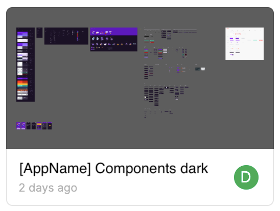  | 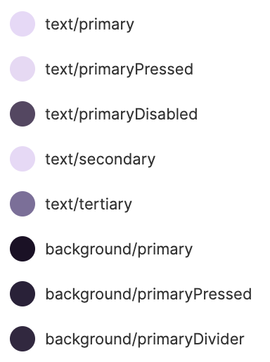  |
| 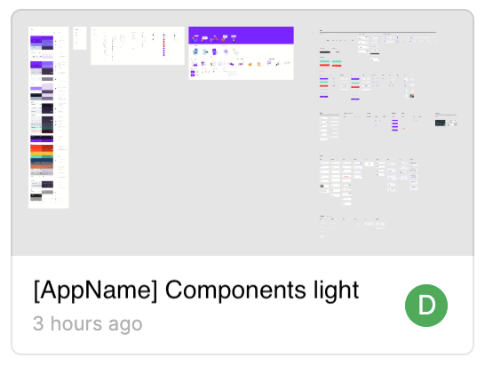 | 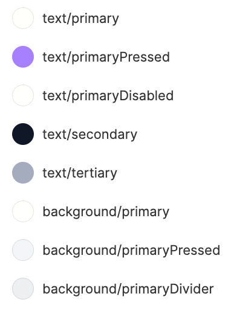 |

For `figma-export icons`

By default, your Figma file should contains a frame with `Icons` name which contains components for each icon. You may change a frame name in a [CONFIG.md](CONFIG.md) file by setting `common.icons.figmaFrameName` property.
If you support dark mode and want separate icons for dark mode, Figma project must contains two files. One should contains a dark icons, and another light icons. If you would like to have light and dark icons in the same file, you can do so with the `useSingleFile` configuration option. You can then denote dark mode icons by adding a suffix like `_dark`. The suffix is also configurable. See [CONFIG.md](CONFIG.md) for more information in the icons section.

For `figma-export images`

Your Figma file should contains a frame with `Illustrations` name which contains components for each illustration. You may change a frame name in a [CONFIG.md](CONFIG.md) file by setting `common.images.figmaFrameName` property.

If you support dark mode you must have two Figma files. The rules for these two files follow the same rules as described above for colors. But If you would like to specify light and dark illustrations in the same file, you can do so with the `useSingleFile` configuration option. You can then denote dark mode illustrations by adding a suffix like `_dark`. The suffix is also configurable. See [CONFIG.md](CONFIG.md) for more information in the illustrations section.

If you want to specify image variants for different devices (iPhone, iPad, Mac etc.), add an extra `~` mark with idiom name. For example add `~ipad` postfix:

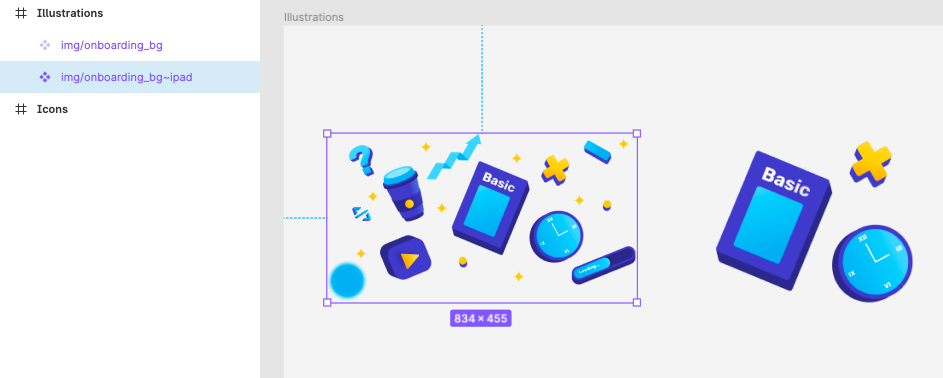

For `figma-export typography`.

Your Figma file must contains Text Styles.

#### Dynamic Type
It is recommended to support [Dynamic Type](https://developer.apple.com/design/human-interface-guidelines/ios/visual-design/typography/#dynamic-type-sizes). Dynamic Type provides additional flexibility by letting readers choose their preferred text size.

If you want to support Dynamic Type you should specify iOS native text style for your custom text styles in the description field of Text Style. Available iOS native text styles you can find on Human Interface Guidlines page in [Typography/Dynamic Type Sizes](https://developer.apple.com/design/human-interface-guidelines/ios/visual-design/typography/#dynamic-type-sizes).

For example: You have `header` text style with 20 pt font size. Native iOS text style that matches is "Title 3". In the description field of your `header` text style you should specify "Title 3".

Advice: Font in Tab Bar and standard Navigation Bar must not support Dynamic Type.

## Example project

Example iOS projects, Android projects and example Figma files see in the [Examples folder](./Examples)

## Contributing

We'd love to accept your pull requests to this project.

## License

figma-export is released under the MIT license. [See LICENSE](./LICENSE) for details.

## Feedback

If you have any issues with the FigmaExport or you want some new features feel free to [create an issue](https://github.com/RedMadRobot/figma-export/issues/new), [open a discussion](https://github.com/RedMadRobot/figma-export/discussions/new) or contact me.

## Authors

Daniil Subbotin - mail@subdan.ru
